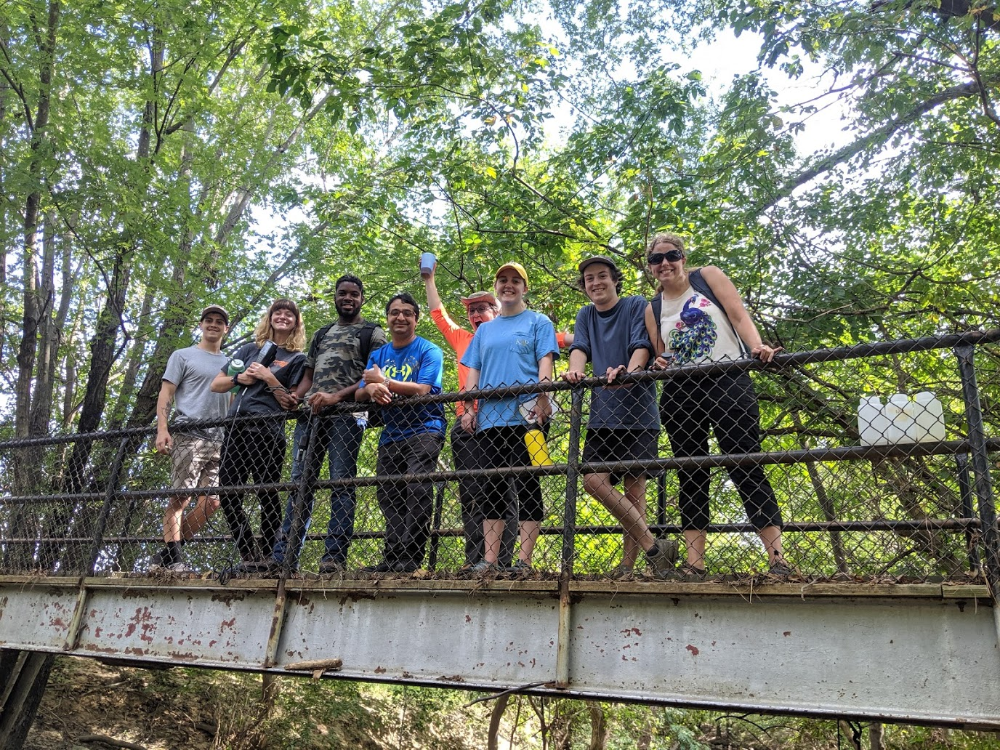
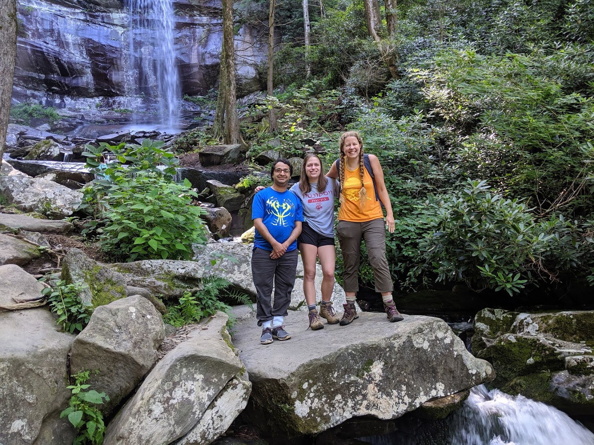

\

*image_caption*

# Urban streams

Dr. Praskievicz integrates research, student learning, and public outreach using
Greensboro’s urban streams as a study area. Her course GES328: The Water Planet involves
undergraduate students in field-based stream research through semester-long projects in which
the physical habitat and water quality of local urban streams are assessed. Dr. Praskievicz
partners with local community groups to select sites and develop project ideas so that the data
collected and analyzed by the students can be used for real-world applications, such as
evaluating the effectiveness of stream enhancement projects and addressing issues of
environmental injustice.

\
\
\
\

  

*From left to right, Raj Sigdel (Ph.D. student), Lena Ben-Gideon (high-school
student field assistant), and Dr. Praskievicz in Great Smoky Mountains
National Park*

\

# Interactions between physical and biological processes in river systems

Dr. Praskievicz is interested in the interactions between abiotic and biotic components of river ecosystems. She supervised research by her former master’s student, Emily Buege, on the Bladen River in Belize. The team used field surveys and ecological modeling to determine the physical habitat controls on cichlid nesting sites and used hydraulic modeling to map channel habitat units from remotely sensed imagery. Dr. Praskievicz has also done extensive research on the science and policy of environmental instream flows, using Alabama (the state with the highest levels of freshwater biodiversity) as a case study. More recently, Dr. Praskievicz has become interested in the dynamics of large wood in streams. She and her Ph.D. student Rajesh Sigdel surveyed streams in Great Smoky Mountains National Park in Tennessee to determine the impact of the 2016 Chimney Tops 2 wildfire on large-wood loads.

\

# Flood-inundation modeling

Through her experience as a Theme Leader in the NOAA National
Water Center Summer Institute in 2015 to 2018, Dr. Praskievicz developed an interest in flood-
inundation modeling. Specifically, she is interested in integrating remote sensing, geospatial
analysis, and hydraulic modeling to simulate flood-inundation extent and depth and to analyze
the physical and socioeconomic controls on flood risk. She has supervised student projects
focused on a variety of different flood types, including urban stormwater flooding, riverine
flooding, and the multiple mechanisms that lead to flooding during tropical cyclones.

\

