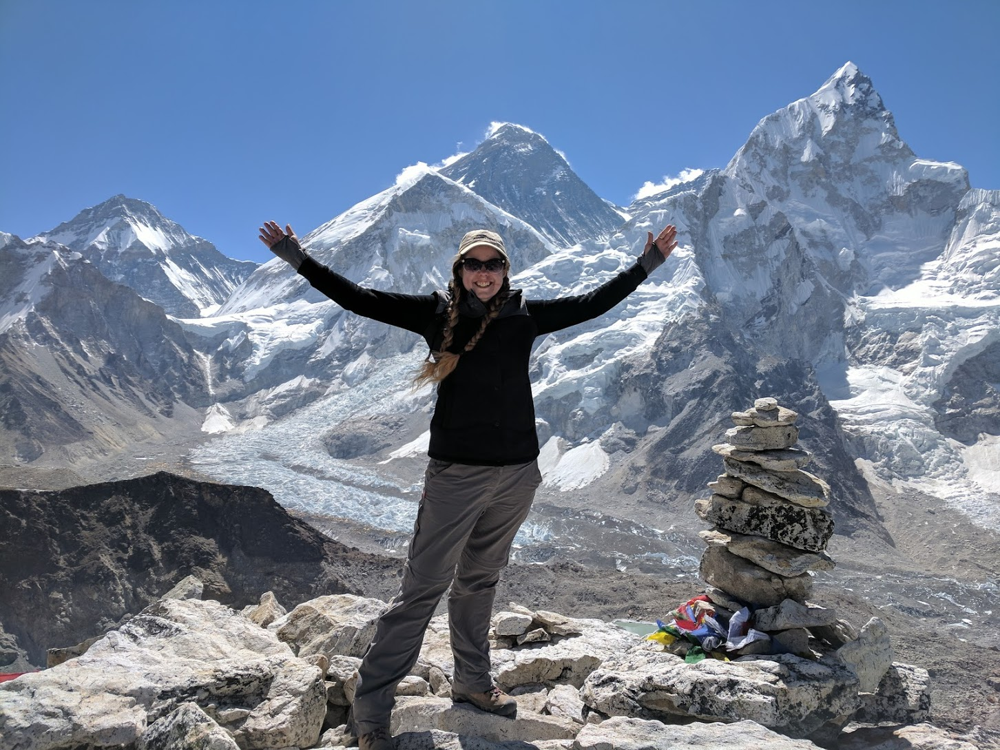
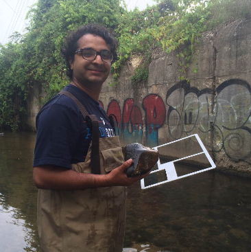
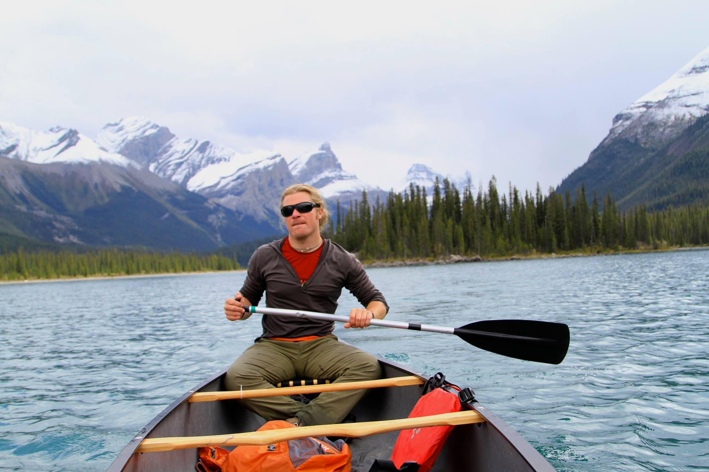
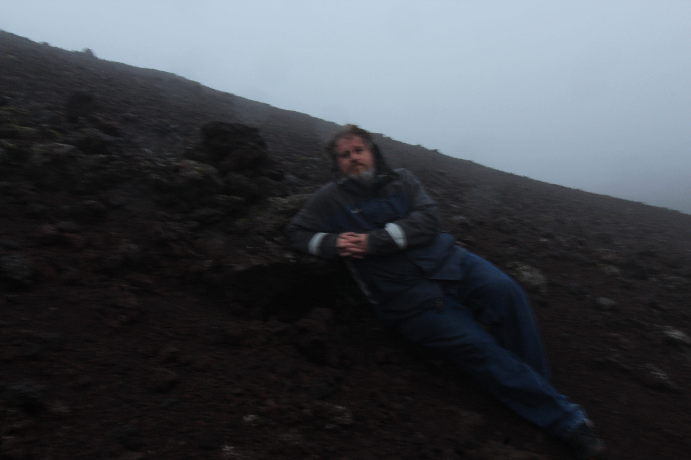

## Current and Past Members

\

**Dr. Sarah Praskievicz** is an Associate Professor in the Department of Geography, Environment,
and Sustainability at the University of North Carolina at Greensboro. Originally from Maine, she
moved with her family to Oregon as a teenager and immediately fell in love with the rivers,
forests, and mountains of the Pacific Northwest. She earned her Ph.D. in Geography from the
University of Oregon in 2014, with her dissertation research focusing on impacts of climate
change on the hydrology and geomorphology of snowmelt-dominated rivers. Her greatest
passion is hiking and outdoor adventure, both close to home and all over the world. She has
traveled and hiked on six continents.

\
\

---

**Rajesh Sigdel, Ph.D. Candidate:** Raj, originally from Nepal, got interested into water science by growing up in the vicinity of many glacier fed rivers in Nepal. As a MS student at Grand Valley State University, Raj conducted an assessment of environmental stressors in an urban stream in Michigan. As a PhD candidate at University of North Carolina at Greensboro, Raj’s research is focused on understanding large wood dynamics in urban streams.

\
\
\
\
\

\
\
\
\
\

---

**Nathan A. Rector, Ph.D. student:** Originally from Texas, USA, Nathan has worked in the
outdoors for 13 years. He has traveled around the world while serving in the US. Marines, then
finished his Master&#39;s degree at Stephen F. Austin State University while running the Outdoor
Recreation Program as a graduate assistant. He then became a field instructor for the National
Outdoor Leadership School, leading extended expeditions in Alaska, Wyoming, and Idaho.
Nathan served as the Coordinator for Iowa State University Outdoor Recreation Program, and
Head of Outdoor Education at the Wooodstock School in the Indian Himalayas where his
certifications from the A.M.G.A.(American Mountain Guide Association) as a Single Pitch
Instructor, Leave No Trace Master Educator and his WMI Wilderness First Responder
certification allowed him to teach and impact students in the field of outdoor education and
recreation in a positive manner for themselves and their environment. Nathan now works as the
Assistant Director of Outdoor Recreation for UNCG in the Kaplan Center and is working on his
Ph.D. in Geography with a focus on Environmental Sustainability. Nathan has traveled around
the world multiple times both on personal trips and while leading students into the outdoors and
loves introducing students how to live outside sustainably. 
Nathan&#39;s research is focused on the visibility of climate change in the Gangotri Glacier and
Ganges headwaters and the subsequent effects on the Hindu pilgrimage to that area. 
When not working, Nathan lives on a small farm outside of Greensboro where he grows and
raises most of his food in a sustainable manner. When not tending to the farm he enjoys whatever
outdoor activity that is best for the season: skiing, sailing, backpacking, running trails, rock
climbing, or paddling trips with his German Shorthair pointer, Miss Kitty.

---

**Stephanie Stephens, undergraduate researcher:** Stephanie M. Stephens was born in Dayton, Ohio, and grew up in the Columbus area. In 1995, her family moved to Cary, NC, where she fell in love with the outdoors. Stephanie enjoys hiking, mountain climbing, and kayaking in the beautiful areas that NC has to offer. She attended Guilford Technical Community College for an A.S before transferring into The University of Carolina Greensboro for a B.A in Environmental Studies and Sustainability. Stephanie is an Undergraduate Research and Creativity (URCA) Grant recipient, winner of the Frank Allison Award from UNC-Chapel Hill, and graduates in December 2020. For her URCA research (supervised by Dr. Praskievicz), Stephanie surveyed neighborhoods of Greensboro with differing income levels about their patterns of and reasons for consumption of bottled water. 

\
\
\
\
\
\

---

<!-- Image Map Generated by http://www.image-map.net/ -->

<map name="image-map">
    <area target="" alt="" title="" href="" coords="8,3,200,199" shape="rect">
    
</map>

**Jamie Watkins:** Jamie is currently wrapping up her Master of Science in Environment and Sustainability. Jamie’s childhood family vacations were mostly camping trips to the Blue Ridge Parkway. These experiences ingrained in her a lifelong love of the outdoors and a profound sense of responsibility for stewardship of the environment. In 2016 Jamie decided to go back to college and get the bachelor’s degree she had always regretted not having. After a 10-year career in massage therapy, Jamie closed her practice and enrolled at Rowan Cabarrus Community College where she got her associate degree. While she was enrolled at RCCC, Jamie became a Volunteer Hunter Education Instructor for the North Carolina Wildlife Resources Commission and a certified Environmental Educator through the North Carolina Department of Environmental Quality. In 2018 Jamie realized that if she was going to lead children on outdoor adventures, she needed to have some top-notch first aid skills. A NOLS Wilderness First Aid class became her gateway into EMS and Search and Rescue. Jamie joined the Rowan County Rescue Squad in January of 2019 and has since become an Advanced EMT, certified Technical Rescuer, and Land Search Field Team Member. Jamie’s love of the outdoors, passion for EMS, and interest in water quality protection all come together in her thesis research. Jamie is investigating a series of rainfall events that placed a significant burden on Fire, Rescue, and EMS in Rowan County in the years 2018 and 2020. She hopes to use her findings to inform infrastructure management and emergency preplanning measures in Rowan County. Jamie has recently moved back to Gaston County and is serving the City of Lowell, NC as the new Stormwater Administrator. Jamie is working to create a citizen science program to educate Lowell families about the importance of stormwater good housekeeping practices and their impacts on water quality in the South Fork River

\

## Past Students

---

**Brent Brackett, M.A. 2020:** Brent graduated with his M.A. in Applied Geography from UNCG
in 2020. His thesis research focused on remote-sensing classification of flooding on North
Carolina’s Neuse River from hurricanes Floyd, Matthew, and Florence. He is now working with
the USDA Natural Resources Conservations Service’s East Remote Sensing Lab in Greensboro,
about 3.7 miles from the Graham building where the GES department is housed. In this position,
he is mapping and georeferencing high-resolution images of conservation territory, wetlands, and
farmlands in the eastern US. The lab works directly with the USDA and other agencies to
provide data and imagery as requested.
