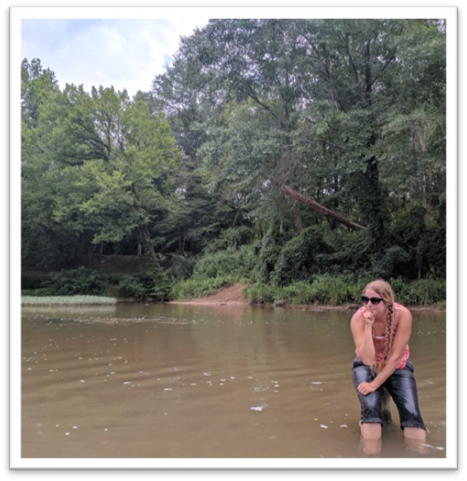
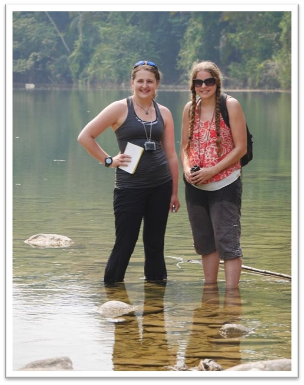

Our regional focus is on the beautifully diverse and
fascinating rivers of the Southeast US, but we have ventured as far afield as the Pacific
Northwest (Dr. Praskievicz’s home region), Central America, and South Asia.

You can explore the rest of this site to see our publications, current projects, and team members.

Dr. Praskievicz is always looking for motivated master’s and Ph.D. students to join her lab. If
you are interested, or if you have any other inquiries, please contact Dr. Praskievicz.  sjpraski AT uncg.edu

**Welcome to Dr. Praskievicz’s River and Water Resources Lab**, in the Department of Geography,
Environment, and Sustainability at the University of North Carolina at Greensboro. 

We study rivers and water resources at a variety of spatial scales, from the impacts of global climate
change on hydrology to the dynamics of sediment transport within river channels. 

We are physical geographers, but we are especially interested in projects that integrate physical and
biological processes in river systems, as well as those with implications for water policy and
management. 

We use a range of different methods, including computational modeling, remote
sensing, geospatial analysis, and fieldwork.

